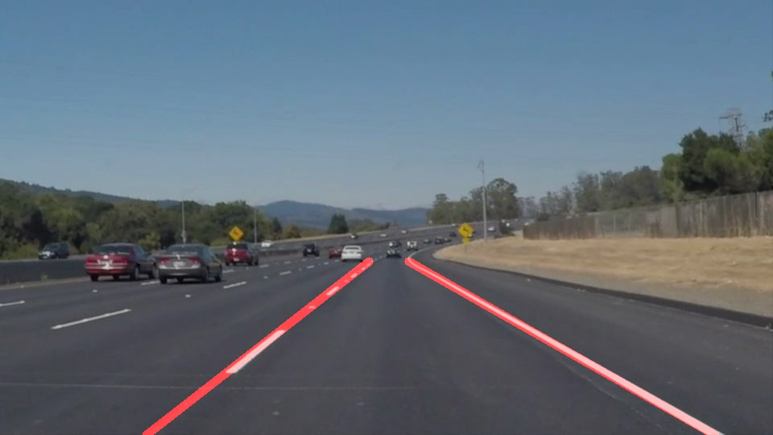

# **Finding Lane Lines on the Road** 

This is my solution to this project.

Pipeline
---
1. Adjust image gamma
2. Turn image into grayscale
3. Blur grayscale image
4. Find edges using Canny
5. Mask region of interest
6. Find lines in Hough space
7. Draw best guessed line
